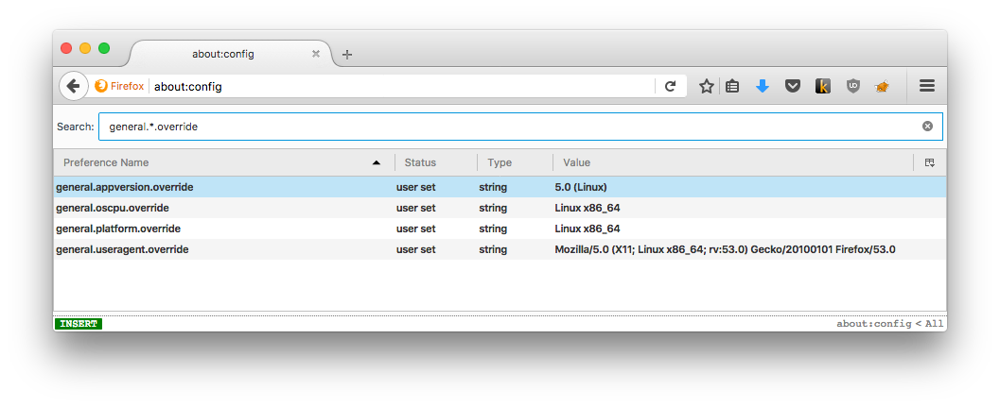

# Spoof Your Browser's Platform

Say, you want to hide from websites the fact that you are using a Mac or a
Windows (or some other) machine. To do this you need to override the following
properties of your browser:

- [User-Agent HTTP Header](https://developer.mozilla.org/en-US/docs/Web/HTTP/Headers/User-Agent/Firefox)
- Navigator WebAPI properties:
    - [Navigator.oscpu](https://developer.mozilla.org/en-US/docs/Web/API/Navigator/oscpu)
    - [NavigatorID.platform](https://developer.mozilla.org/en-US/docs/Web/API/NavigatorID/platform)
    - [NavigatorID.appVersion](https://developer.mozilla.org/en-US/docs/Web/API/NavigatorID/appVersion)

The first is transmitted within an HTTP request and the rest three can be
retrieved with a JavaScript.

## Firefox

First, open the The Firefox Configuration Editor (`about:config` page). You can
find more information here:
[Mozilla Support](https://support.mozilla.org/en-US/kb/about-config-editor-firefox).

Now you need to create 4 preferences of type _String_ and set their values.
To add a new preference, right-click anywhere in the list of preferences.

You can set the values as you want (read their descriptions first).

I set them as like I am using a Linux machine:

  - `general.useragent.override`: `Mozilla/5.0 (X11; Linux x86_64; rv:53.0) Gecko/20100101 Firefox/53.0`
  - `general.oscpu.override`: `Linux x86_64`
  - `general.platform.override`: `Linux x86_64`
  - `general.appversion.override`: `5.0 (Linux)`

----

You may use these services to see what information a website retrieves from you
browser:
   - <http://yandex.ru/internet>
   - <http://browserspy.dk/os.php>
